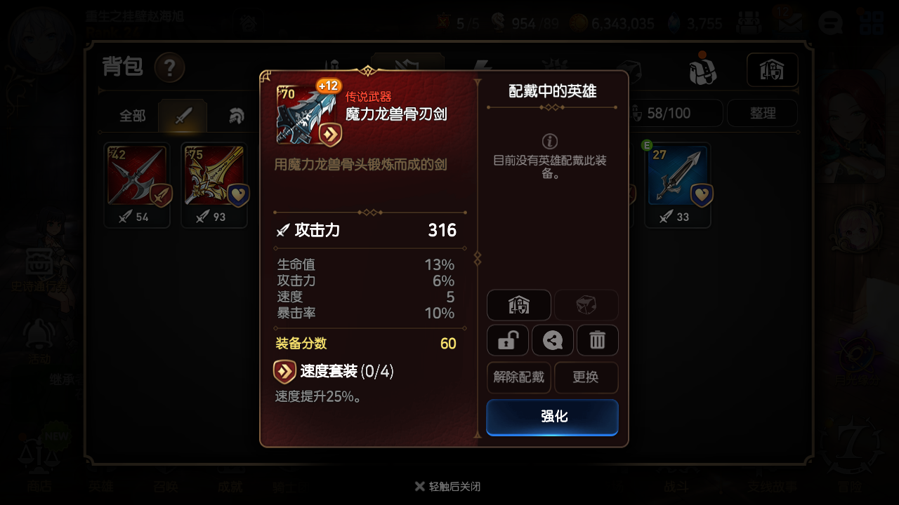
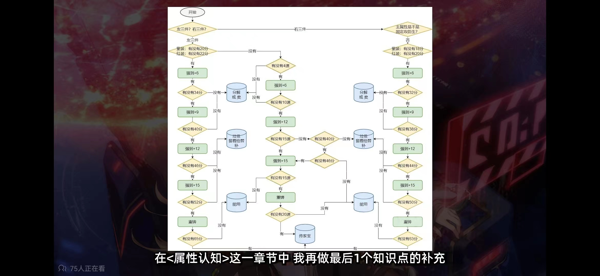

# Epic7-Item-Estimator

**目前还是测试状态 不稳定 谨慎使用  当前仅支持模拟器**

## 环境配置 & 编译运行

1. 安装并使用3.8版本以上python （本项目使用python 3.8编写）
2. 下载项目后，在项目根目录打开控制台输入
   ```bash
   pip install -r requirements.txt
   ```
    或使用 Pycharm 等IDE环境安装依赖
   
3. 请安装Tesseract OCR

   对于熟练的编程人员，您可以选择编译Tesseract源代码：访问 [Tesseract OCR 的官方 GitHub 仓库：](https://github.com/tesseract-ocr/tesseract/releases/tag/5.3.2)
   
   **推荐**
   或者您可以选择访问[Tesseract at UB Mannheim](https://github.com/UB-Mannheim/tesseract/wiki) 下载并安装Tesseract OCR
   **由于国内下载巨慢，所以我直接在release中打包了这个安装包**
   解压缩后运行tesseract-ocr-w64-setup-5.3.1.20230401.exe安装
   **请留意安装路径，这个路径默认为：C:\Program Files\Tesseract-OCR**
   打开这个文件夹下的tessdata文件夹，并将我的程序所在文件夹下的 “请将这个文件夹内的E7.traineddata拷贝到tessracet下” 文件夹打开，如这个文件的名字所述，将里面的E7.traineddata拷贝到对应位置。
   如果是默认路径，则应该拷贝到C:\Program Files\Tesseract-OCR\tessdata中
   
   在该目录下的tessdata中拷贝本项目中的 **E7.traineddata** 这个文件是我训练的用于识别第七史诗游戏内字体的OCR模型

   如果您是OCR相关的工作者或对于OCR有一定的了解，欢迎各位改进或提供更优秀的模型
   
4. 在项目根目录下执行 py ./main.py 即可运行

## 使用说明 & Release版本运行

**请务必先安装Tesseract OCR 参见环境配置第三条**

1. 请将模拟器分辨率设置为：宽 720 长 1280 DPI 320，因为是采取图片文字提取的方式读取装备词条，需要保证分辨率与我代码中设置的一致，目前暂不支持自适应分辨率
2. **首先请连接ADB**  在模拟器的根目录下  打开控制台输入
   ```bash
   adb.exe kill-server
   adb.exe devices
   ```
   此时应该可以看到当前连接的ADB列表，如果没有其他设备通过ADB调试，这个列表应该为空
4. 然后打开模拟器，同时**确保模拟器开启了ADB调试功能**，通常这个功能在模拟器的其他设置选项卡中开启，找不到开启的方法请自行百度
5. **目前可以自动连接到ADB，直接点击连接按钮即可** 如果不能正确连接到ADB，请手动输入ADB端口，不同模拟器ADB端口不同 例如：雷电模拟器端口为5555 请将对应模拟器的端口号写入 ADB端口号的文字框  例如：雷电模拟器就写 127.0.0.1:5555  （mumu的应该是7555，其他的自行百度） 然后点击 连接ADB 按钮 等待约2秒后 提示连接成功 即说明成功连接到ADB
6. 在装备属性界面点击计算即可看到是否应该进一步强化的信息：
   
   
   ~~**请务必在这个界面点击计算按钮，在其他位置点击将会导致程序崩溃**~~        **已经修复**
   
   ~~**项目目前仅支持红色与紫色装备的计算，计算其他类型装备将导致程序崩溃**~~  **已经修复**
   
   ~~这些问题会解决，也很好解决，我明确的知道问题出在哪，但目前只有我一个人在开发，时间有限所以先这样，能用就行（明明就是在摸鱼！！！ 划掉）~~
8. 强化的计算过程参考下面这张流程图：
   
   
   **特别感谢鱼大夫提供的装备强化相关的说明，因为这个游戏我玩的并不多，很多知识并不理解，如果有错误也欢迎各位提交issue**
   
   **这张截图出处是哪个视频我并不清楚，也特别感谢该视频的作者以及强化思路的创作者，如有知道出处的请告知我，我会随后附上**

   ## TODO

   1. 当然是先让我想想怎么写TODO List了！~~（逃）~~
